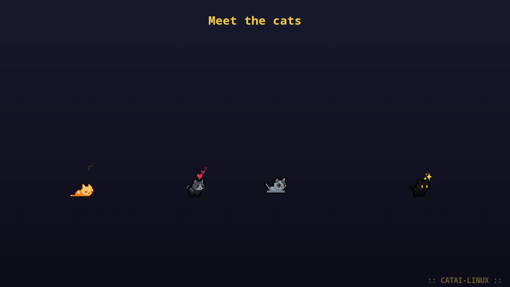
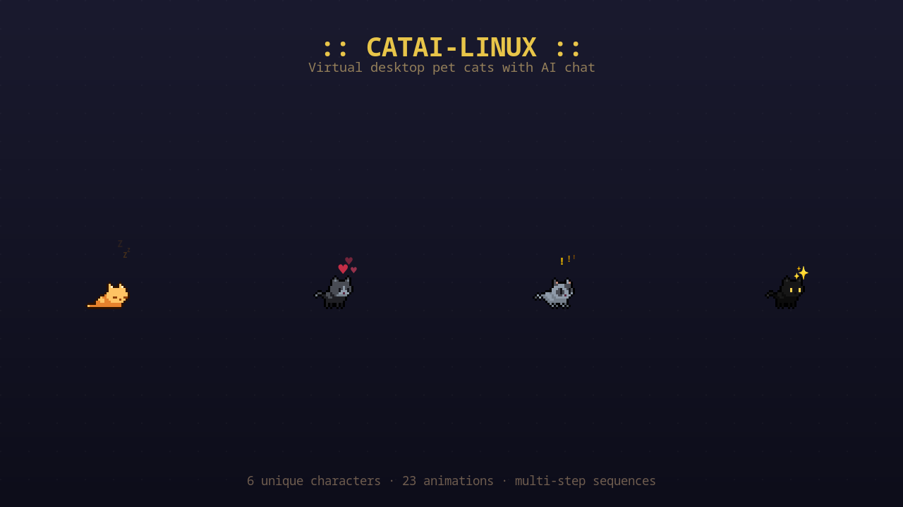
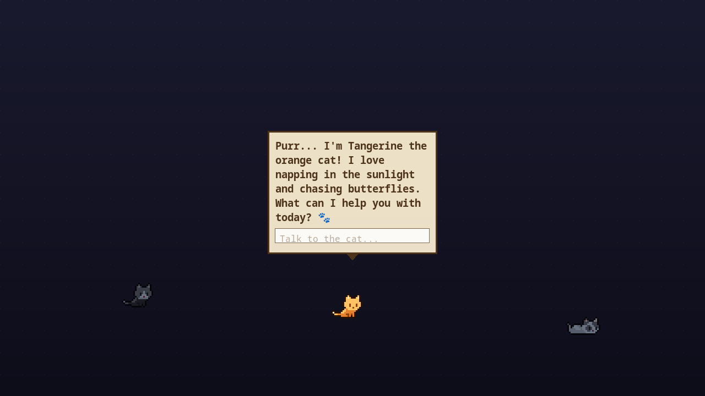
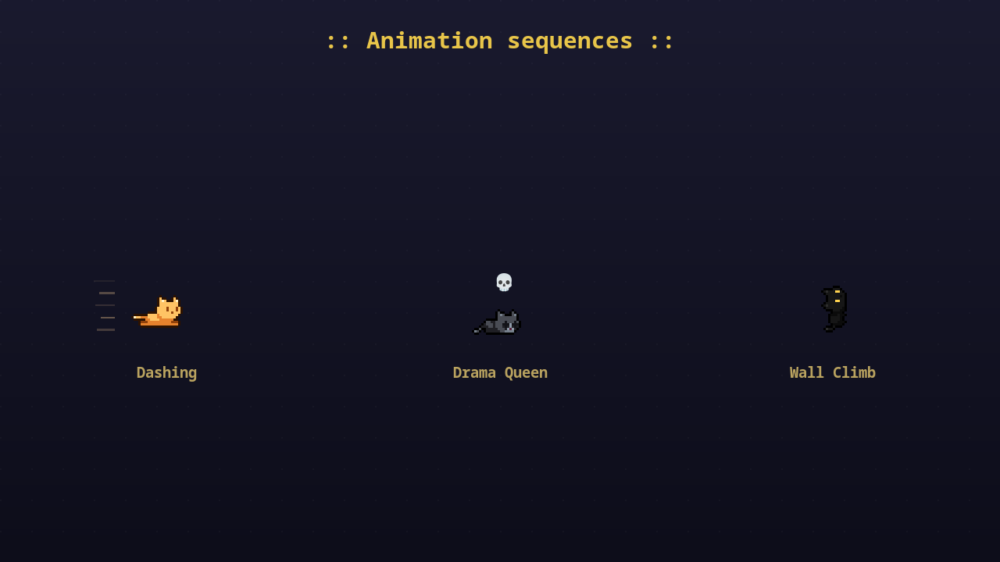

# CATAI-Linux

Virtual desktop pet cats for Linux (GNOME/Wayland) -- pixel art cats that roam your screen and chat with you via AI.

   

Port of [CATAI](https://github.com/wil-pe/CATAI) (macOS/Swift) to Linux.









## Features

- **Desktop companion** -- Cats roam freely across your screen with pixel-perfect animations
- **Click-through** -- Cats float above all windows, clicks pass through to apps below
- **6 unique characters** -- Pre-colored 80×80 sprites from the catset collection, each with a distinct look and personality
- **AI chat** -- Click a cat to open a pixel-art chat bubble, powered by [Claude](https://claude.ai) or [Ollama](https://ollama.ai)
- **Rich animations** -- 23 animation states including running, dashing, sleeping, grooming, climbing, wall grab, ledge climbing, dying & resurrection, and more
- **Animation sequences** -- Multi-step scripted behaviors: wall adventures, ledge climbing, dash crashes, dramatic deaths with resurrection
- **Visual overlays** -- Floating ZzZ, hearts, speed lines, hurt stars, skulls, sparkles above cats during animations
- **Random meows** -- Cats spontaneously say "Miaou~", "Prrr...", "Mrrp!" in cute speech bubbles
- **Drag & drop** -- Drag cats anywhere on your screen
- **Cat encounters** -- When two cats cross paths, they stop and have a short AI-generated conversation
- **Multilingual** -- French, English, Spanish
- **Persistent** -- Cats remember their conversations between sessions

## Cat Characters

Each character is a pre-colored sprite with a unique personality:

| Sprite | Name (default) | Personality | Specialty |
|--------|---------------|-------------|-----------|
| 🟠 Orange | Mandarine | Espiègle et joueur | Bêtises et mouvement |
| 🟤 Tabby | Tabby | Curieux et aventurier | Explorer chaque recoin |
| ⬛ Dark | Ombre | Mystérieux et silencieux | Paroles rares mais profondes |
| 🟫 Brown | Noisette | Doux et réconfortant | Câlins et bonne humeur |
| 🩶 Grey | Brume | Sage et philosophe | Pensées profondes sur la vie |
| 🖤 Black | Minuit | Élégant et nocturne | Histoires mystérieuses |

Names and languages adapt to your selected language (FR / EN / ES).

## AI Backend

CATAI-Linux supports two AI backends for cat conversations:

| Backend | Setup | Speed | Cost |
|---------|-------|-------|------|
| **Claude** (recommended) | Auto-detected if [Claude Code](https://claude.ai/download) is installed | ~1-2s | Included with Claude subscription |
| **Ollama** | `./setup-ollama.sh` | ~2-5s | Free (local) |

Claude is auto-detected from Claude Code's credentials (`~/.claude/.credentials.json`) or the `ANTHROPIC_API_KEY` environment variable. If neither is available, CATAI falls back to Ollama.

## Requirements

- Linux with GNOME, KDE, or any X11/XWayland desktop
- Python 3.10+

## Install

```bash
# System dependencies (GTK4 + Cairo bindings, not available via pip)
# Fedora:
sudo dnf install python3-gobject
# Ubuntu/Debian:
sudo apt install python3-gi python3-gi-cairo gir1.2-gtk-4.0

# Install from PyPI
pip install catai-linux
```

## Run

```bash
catai
```

## Settings

Right-click any cat to access Settings:

- **Language** -- French / English / Spanish
- **Characters** -- Click a sprite to add it, click again to select it (shows name + personality), click × to remove
- **Name** -- Rename each cat directly in the settings panel
- **Size** -- Scale slider
- **Model** -- Choose between Claude and Ollama models
- **Autostart** -- Launch at login
- **Cat encounters** -- Enable/disable random cat-to-cat conversations

## How It Works

- Single fullscreen transparent canvas with Cairo rendering
- XShape / GDK input region passthrough -- clicks go through to apps below
- 80×80 pre-colored PNG sprites (catset by seethingswarm, upscaled 2× with nearest-neighbor)
- 23 animation states with multi-step sequences (wall adventure, ledge climbing, dash crash, dramatic death)
- Generalized pixel-accurate offset compensation for seamless transitions between any animation
- Visual overlays via PangoCairo: ZzZ, hearts, speed lines, hurt stars, skulls, sparkles, anger marks
- Claude API or Ollama for streaming AI chat
- Lazy loading + disk cache for instant startup
- Config persisted in `~/.config/catai/`

## Development

```bash
make lint    # Run ruff linter
make fix     # Auto-fix lint issues
make e2e     # Run E2E test suite (26 tests)
make run     # Launch the app
make build   # Build wheel + sdist
```

Sprite conversion (catset spritesheets → CATAI character directories):

```bash
python3 scripts/catset_to_catai.py catset_assets/catset_spritesheets catai_linux/
```

Regenerate README assets (screenshots + demo GIF, no screen capture required):

```bash
python3 tools/render_screenshots.py   # → screenshot1..3.png
python3 tools/render_demo_gif.py      # → demo.gif
```

## Project Structure

```
.
├── catai_linux/          # Python package
│   ├── app.py            # Main application
│   ├── __main__.py       # Entry point (python -m catai_linux)
│   ├── cat_orange/       # Sprite assets — orange cat (80×80 PNG)
│   ├── cat01/            # Sprite assets — tabby
│   ├── cat02/            # Sprite assets — dark cat
│   ├── cat03/            # Sprite assets — brown cat
│   ├── cat04/            # Sprite assets — grey cat
│   └── cat05/            # Sprite assets — black cat
├── scripts/
│   └── catset_to_catai.py  # Spritesheet conversion tool
├── tools/
│   └── sprite_preview.py   # Visual preview of all sprites + overlays
├── tests/
│   └── e2e_test.py       # E2E test suite (socket-based)
├── pyproject.toml        # Package config + linter config
├── Makefile              # make run / lint / e2e / build
└── .github/workflows/    # CI: lint + PyPI publish
```

## Credits

- Original macOS version: [wil-pe/CATAI](https://github.com/wil-pe/CATAI)
- Catset sprites: [seethingswarm/catset](https://github.com/seethingswarm/catset) (CC0)

## License

MIT

---

## Changelog

### v0.3.2 — README demo + proactive auth refresh (2026-04-10)

- **New README assets**: animated `demo.gif` + 3 static screenshots rendered directly via Cairo (no screen capture needed — bypasses Wayland entirely)
- **Rendering tools**: `tools/render_screenshots.py` and `tools/render_demo_gif.py` — reproducible, deterministic, GIF palette-optimized (~230 KB for 14s @ 12fps)
- **Proactive Claude auth refresh**: token is now refreshed BEFORE it expires (5 min buffer) instead of waiting for a 401, eliminating authentication errors during chat
- **Test socket extensions**: new commands `force_state`, `start_sequence`, `meow`, `move_cat`, `fake_chat` for scripted testing and automation
- **Fix**: `cat_positions` test command was using the old `color_id` field that no longer exists on catset cats

### v0.3.1 — Animation sequences + visual overlays (2026-04-09)

- **10 new animations**: dash, die, fall, hurt, land, wall climb, wall grab, ledge grab, ledge idle, ledge struggle
- **Multi-step sequences**: wall adventure (climb → grab → fall → land), ledge adventure, dash crash, full jump, drama queen (hurt → die → resurrect)
- **Visual overlays**: ZzZ (sleep), ♥ (love), !!! (surprised), ✦ (hurt), 💀 (dying), ✨ (grooming), 💢 (angry), speed lines (dash)
- **Dashing**: cats sprint across the screen at 3× walk speed with speed lines behind them
- **Dying & resurrection**: cats stay dead 5-10s with floating skull, then hurt animation plays 3× before waking up
- **Wall grab sliding**: cats slide slowly downward while grabbing a wall, then let go
- **Sprite preview tool**: `python3 tools/sprite_preview.py` — visual grid of all cats, animations, overlays, and bubbles
- **Fix**: meow bubble and overlay positioning (relative to cat head, not bounding box top)

### v0.3.0 — Catset characters + new animations (2026-04-09)

- **6 pre-colored characters** replacing the old single-sprite + color-tinting system: orange, tabby, dark, brown, grey, black (80×80 catset sprites)
- **New animation states**: flat/sit, love loaf, grooming, rolling, surprised, jumping, climbing
- **Climbing mechanic**: cats climb walls with pixel-accurate floor/centroid measurement so transitions to the next animation are seamless
- **Settings rework**: click a cat sprite to select it and see its name (editable), personality trait, and description
- **Walk directions**: east/west only — catset sprites don't have north/south/diagonal walk frames
- **Removed**: old color-tinting system, drinking, playing ball, butterfly, scratching tree, peeing, pooping animations (not in catset)
- **Fix**: click-to-chat bubble not triggering on Wayland (GDK input region was skipped)
- **Fix**: meow bubble squished — height now based on actual Pango text metrics, not a hardcoded `24px`

### v0.2.2 — Emoji in bubbles + bubble overflow fix (2026-04-04)

- Speech bubbles now render emoji correctly via PangoCairo (COLRv1 fonts)
- Chat bubble no longer overflows screen edges — clamps and wraps text properly

### v0.2.1 — Cat encounters (2026-04-01)

- When two cats cross paths they stop, face each other, and exchange 1–3 AI-generated lines before going their separate ways
- Encounter bubbles shown above each cat with pixel-art style

### v0.2.0 — Multi-cat + drag & drop (2026-03-28)

- Up to 6 simultaneous cats, each with a distinct color and AI personality
- Drag cats anywhere on screen
- Persistent chat memory per cat across sessions

### v0.1.0 — Initial release (2026-03-20)

- Single desktop cat with pixel-art animations
- AI chat via Claude or Ollama
- Click-through transparent window (XShape)
- French / English / Spanish support
