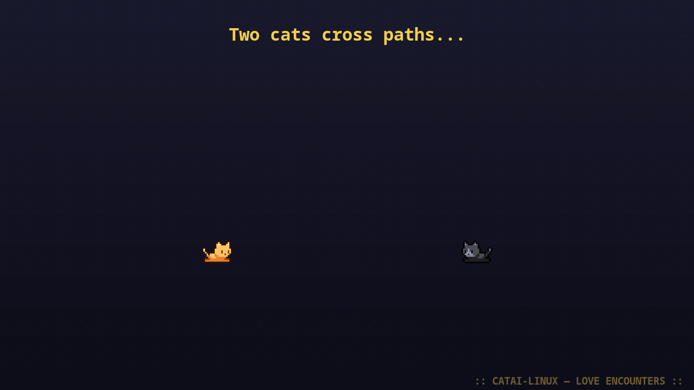

# CATAI-Linux

Virtual desktop pet cats for Linux (GNOME/Wayland) -- pixel art cats that roam your screen and chat with you via AI.

   

Port of [CATAI](https://github.com/wil-pe/CATAI) (macOS/Swift) to Linux.





## Features

- **Desktop companion** -- Cats roam freely across your screen with pixel-perfect animations
- **Click-through** -- Cats float above all windows, clicks pass through to apps below
- **6 unique characters** -- Pre-colored 80×80 sprites from the catset collection, each with a distinct look and personality
- **AI chat** -- Click a cat to open a pixel-art chat bubble, powered by [Claude](https://claude.ai) or [Ollama](https://ollama.ai)
- **Voice chat** 🎤 (optional) -- Hold the mic button or simply hold **Space** to talk to your cats. 100% local transcription via [faster-whisper](https://github.com/SYSTRAN/faster-whisper), GPU-accelerated if you have CUDA
- **Rich animations** -- 23 animation states including running, dashing, sleeping, grooming, climbing, wall grab, ledge climbing, dying & resurrection, and more
- **Animation sequences** -- Multi-step scripted behaviors: wall adventures, ledge climbing, dash crashes, dramatic deaths with resurrection
- **Visual overlays** -- Floating ZzZ, hearts, speed lines, hurt stars, skulls, sparkles above cats during animations
- **Random meows** -- Cats spontaneously say "Miaou~", "Prrr...", "Mrrp!" in cute speech bubbles
- **Drag & drop** -- Drag cats anywhere on your screen
- **Cat encounters** -- When two cats cross paths, they stop and have a short AI-generated conversation
- **Love encounters & kittens** -- Sometimes a cat falls in love; if the other reciprocates, a kitten is born with the parent's color (fade-in + sparkles). Kittens can't chat yet — they meow with baby emojis 🐭 🍼 ♥ 🧸
- **22 hidden easter eggs** 🥚 -- type `easter egg` in a chat bubble for the full menu, or trigger any one directly with a magic phrase: `nyan`, `rain`, `hug`, `42`, `matrix`, `thanos`, `boss fight`, `disco`, `stampede`, `meow party`, `don't panic`... and many more. Even Nyan Cat with a proper 6-frame animated sprite and wavy tiled rainbow trail!
- **Multilingual** -- French, English, Spanish
- **Persistent** -- Cats remember their conversations between sessions

## Cat Characters

Each character is a pre-colored sprite with a unique personality:

| Sprite | Name (default) | Personality | Specialty |
|--------|---------------|-------------|-----------|
| 🟠 Orange | Mandarine | Espiègle et joueur | Bêtises et mouvement |
| 🟤 Tabby | Tabby | Curieux et aventurier | Explorer chaque recoin |
| ⬛ Dark | Ombre | Mystérieux et silencieux | Paroles rares mais profondes |
| 🟫 Brown | Noisette | Doux et réconfortant | Câlins et bonne humeur |
| 🩶 Grey | Brume | Sage et philosophe | Pensées profondes sur la vie |
| 🖤 Black | Minuit | Élégant et nocturne | Histoires mystérieuses |

Names and languages adapt to your selected language (FR / EN / ES).

## AI Backend

CATAI-Linux supports two AI backends for cat conversations:

| Backend | Setup | Speed | Cost |
|---------|-------|-------|------|
| **Claude** (recommended) | Auto-detected if [Claude Code](https://claude.ai/download) is installed | ~1-2s | Included with Claude subscription |
| **Ollama** | `./setup-ollama.sh` | ~2-5s | Free (local) |

Claude is auto-detected from Claude Code's credentials (`~/.claude/.credentials.json`) or the `ANTHROPIC_API_KEY` environment variable. If neither is available, CATAI falls back to Ollama.

## Requirements

- Linux with GNOME, KDE, or any X11/XWayland desktop
- Python 3.10+

## Install

```bash
# System dependencies (GTK4 + Cairo bindings, not available via pip)
# Fedora:
sudo dnf install python3-gobject
# Ubuntu/Debian:
sudo apt install python3-gi python3-gi-cairo gir1.2-gtk-4.0

# Install from PyPI
pip install catai-linux

# Optional: adds ~100 MB of extra deps (faster-whisper + CTranslate2)
# needed for the push-to-talk voice chat feature. Only install this if
# you actually want to talk to your cats.
pip install catai-linux[voice]
```

## Run

```bash
catai
```

## Settings

Right-click any cat to access Settings:

- **Language** -- French / English / Spanish
- **Characters** -- Click a sprite to add it, click again to select it (shows name + personality), click × to remove
- **Name** -- Rename each cat directly in the settings panel
- **Size** -- Scale slider
- **Model** -- Choose between Claude and Ollama models
- **Autostart** -- Launch at login
- **Cat encounters** -- Enable/disable random cat-to-cat conversations
- **Voice chat** -- Enable push-to-talk mic button + hold-Space recording (requires `pip install catai-linux[voice]`)
- **Voice model** -- Pick the Whisper model (tiny → large-v3), each annotated with size and recommended device

## How It Works

- Single fullscreen transparent canvas with Cairo rendering
- XShape / GDK input region passthrough -- clicks go through to apps below
- 80×80 pre-colored PNG sprites (catset by seethingswarm, upscaled 2× with nearest-neighbor)
- 23 animation states with multi-step sequences (wall adventure, ledge climbing, dash crash, dramatic death)
- Generalized pixel-accurate offset compensation for seamless transitions between any animation
- Visual overlays via PangoCairo: ZzZ, hearts, speed lines, hurt stars, skulls, sparkles, anger marks
- Claude API or Ollama for streaming AI chat
- Lazy loading + disk cache for instant startup
- Config persisted in `~/.config/catai/`

## Development

```bash
make lint    # Run ruff linter
make fix     # Auto-fix lint issues
make test    # Run headless unit tests (59 assertions, no GTK display needed)
make e2e     # Run the full E2E test suite (48 assertions via Unix socket)
make run     # Launch the app
make build   # Build wheel + sdist
```

`make e2e` runs locally against a real GDK display + a real AI backend. In
CI, the same suite runs inside the `e2e-tests` job of
`.github/workflows/test.yml` via Xvfb + metacity + a `MockChat` backend
activated by `CATAI_MOCK_CHAT=1`, so every PR gets the 48 assertions
validated against a fresh Ubuntu runner before merge.

Sprite conversion (catset spritesheets → CATAI character directories):

```bash
python3 scripts/catset_to_catai.py catset_assets/catset_spritesheets catai_linux/
```

Regenerate README assets (screenshots + demo GIF, no screen capture required):

```bash
python3 tools/render_screenshots.py   # → screenshot1..3.png
python3 tools/render_demo_gif.py      # → demo.gif
```

## Project Structure

```
.
├── catai_linux/          # Python package
│   ├── __main__.py       # Entry point (python -m catai_linux)
│   ├── app.py            # Main application + CatAIApp + CatInstance
│   ├── chat_backend.py   # Claude + Ollama streaming backends
│   ├── voice.py          # Push-to-talk recording + Whisper transcription
│   ├── drawing.py        # Cairo/Pango helpers (bubbles, overlays, CSS)
│   ├── x11_helpers.py    # Low-level Xlib/XShape via ctypes
│   ├── l10n.py           # Localization strings (fr/en/es)
│   ├── cat_orange/       # Sprite assets — orange cat (80×80 PNG)
│   ├── cat01..05/        # Sprite assets — tabby/dark/brown/grey/black
│   └── kitten*/          # Kitten sprites (inherited from cat parent)
├── scripts/
│   ├── catset_to_catai.py   # Catset spritesheet conversion
│   ├── kittens_to_catai.py  # Kitten spritesheet conversion
│   └── sd_postprocess.py    # Stable Diffusion output post-processing
├── tools/
│   ├── sprite_preview.py    # Visual preview of all sprites + overlays
│   ├── render_screenshots.py  # Generate README screenshots
│   ├── render_demo_gif.py     # Generate demo.gif
│   └── render_love_demo.py    # Generate love_demo.gif
├── tests/
│   └── e2e_test.py       # E2E test suite (26 tests via Unix socket)
├── pyproject.toml        # Package config + linter config
├── Makefile              # make run / lint / e2e / build
└── .github/workflows/    # CI: lint + PyPI publish
```

## Credits

- Original macOS version: [wil-pe/CATAI](https://github.com/wil-pe/CATAI)
- Catset sprites: [seethingswarm/catset](https://github.com/seethingswarm/catset) (CC0)

## License

MIT

---

## Changelog

### v0.5.0 — Big cleanup: modular refactor + smaller wheel (2026-04-10)

Internal overhaul — no user-facing feature changes. If v0.4.0 works for
you, v0.5.0 works the same, just lighter and cleaner under the hood.

- **Wheel size: 2.5 MB → 1.6 MB** (−36%) — removed the legacy
  `cute_orange_cat/` sprite directory (2.1 MB of 68×68 sprites that
  were shipped in every release since v0.1.0 but have not been loaded
  at runtime since the v0.3.0 catset migration). Removed the obsolete
  `MANIFEST.in` that was keeping them in the distribution.
- **Modular architecture**: `catai_linux/app.py` split from 6044 lines
  into 6 focused modules. Smaller files, easier to navigate, easier to
  test, lazy imports for optional features:
  - `app.py` (4200 lines) — `CatAIApp`, render loop, main
  - `chat_backend.py` (310 lines) — `ChatBackend`, `ClaudeChat`,
    `OllamaChat`, `create_chat`, Claude OAuth helpers, Ollama probing
  - `voice.py` (220 lines) — `VoiceRecorder`, Whisper model metadata,
    HuggingFace cache detection
  - `drawing.py` (480 lines) — CSS theme + all Cairo/Pango drawing
    helpers (speech bubbles, overlays, context menu, sparkles)
  - `x11_helpers.py` (310 lines) — low-level Xlib/XShape via ctypes
  - `l10n.py` (44 lines) — localization strings + random meow pool
- **Dead code purge: −800 lines** of unused classes, helpers, and
  unreachable legacy branches:
  - `ChatBubbleController` class (150 lines) — old Gtk.Window-based
    bubble, replaced by the Cairo canvas rendering in v0.3.x
  - Legacy color-tinting system (`CatColorDef` class, `CAT_COLORS`
    table with 6 pre-baked personalities, `tint_sprite`,
    `rgb_to_hsb`/`hsb_to_rgb`, `load_and_tint` with disk cache)
  - 6 unreachable `CatState` enum members (`DRINKING`, `PLAYING_BALL`,
    `BUTTERFLY`, `SCRATCHING_TREE`, `PEEING`, `POOPING`) plus their
    dispatch branches and all 7 drawing helpers that existed only to
    render their props (butterfly, tree with bark+foliage+scratches,
    pee drops, poop drops with flies, yarn ball)
  - `CatAIApp.add_cat` / `remove_cat` / `rename_cat` — legacy
    color-based cat management, superseded by `add_catset_char` etc.
  - `SettingsWindow._on_bubble_*` / `_on_name_changed` — handlers for
    the old color-bubble UI, never connected to any widget
  - `draw_pixel_border`, `_pango_text_width`, `_load_anims_bg`,
    `_get_preview`, `_get_anim_frames` — helpers with zero callers
- **Perf**: cached Pango layout across render ticks in
  `_position_chat_entry()` (was re-allocating a `cairo.ImageSurface`,
  context, layout, and font description every frame when a chat bubble
  was visible — ~0.5–1 ms/frame saved). Dirty-key cache for
  `_update_input_regions()` skips the expensive `cairo.Region` rebuild
  on frames where no cat has moved (the common idle case — ~0.5 ms
  saved per skipped frame on an 8 FPS loop).
- **Code quality**: `_handle_test_cmd()` (197 lines, 19 if/elif
  branches) refactored into 21 small `_cmd_*` handlers dispatched via
  a dict — each command is now an independently-readable 5–10 line
  method. Added `_get_cat_at_idx()` helper to deduplicate index
  parsing.
- **Type hints** on all public APIs of the new modules
  (`ChatBackend.send`, `VoiceRecorder.*`, drawing helpers, etc.) for
  IDE autocomplete and future `mypy` support.
- **Housekeeping**: `.gitignore` now excludes raw sprite sources
  (`catset_assets/`, `kittens_assets/`); removed obsolete
  `scripts/generate_sprites.py`, `scripts/catai_sprites.ipynb`,
  `docs/feature_kittens.md`, and empty `scripts/references/` /
  `scripts/sd_workflows/` directories.

### v0.4.0 — Voice chat + instant startup (2026-04-10)

- **Voice chat (push-to-talk)** 🎤 — talk to your cats instead of typing. Hold the mic button next to the chat entry, or simply **hold Space** while the entry is focused and empty (just like `/voice` in Claude Code). Release to auto-transcribe and send.
- **100% local & private** — speech-to-text runs on-device via [faster-whisper](https://github.com/SYSTRAN/faster-whisper). Nothing is sent to any cloud service for transcription.
- **GPU auto-detection** — CUDA is used automatically if available (float16), otherwise CPU int8. Tested on RTX 2050 / 5090.
- **Whisper model picker in Settings** — 7 models from `tiny` (39 MB, CPU) to `large-v3` (1.5 GB, GPU), each annotated with size and recommended device. Changes take effect immediately, no restart needed.
- **Model preload at startup** — if the selected Whisper model is already cached, it loads into memory in the background while the cats spawn, so the first recording is instant (no 1–3 s wait).
- **Token refresh feedback** — when the Claude OAuth token needs refreshing mid-conversation, the chat bubble now shows an animated braille spinner with "Renouvellement du token Claude..." instead of a silent stall.
- **Instant click on startup** — fixed a 4–5 s freeze where clicking on a cat did nothing during the first seconds. All heavy per-cat setup (sprite loading, animation offsets, pixel-scan floor detection, chat backend creation) now runs in background threads so the main event loop is responsive from t=0.
- **Soft dependency** — the voice feature is opt-in. Install with `pip install catai-linux[voice]`, then enable via `--voice` CLI flag or Settings checkbox. The mic button only appears when enabled, and the feature degrades gracefully if `faster-whisper` is not installed.
- **Settings window** — auto-sized to fit screen height (max 900 px, min 480 px), scrollable for smaller displays.

### v0.3.6 — 22 easter eggs + Nyan Cat + magic phrases (2026-04-10)

- **Easter egg menu** 🥚 — type `easter egg` in any chat bubble to open a clickable menu of 22 fun effects. The menu disappears as soon as you click an egg so you can actually see the effect
- **22 easter eggs** with direct magic phrases (type them in a chat bubble):
  - 💥 Apocalypse (`apocalypse`, `kaboom`, or `Don't panic`) — kittens double every second up to 1000
  - 🌀 Circle 42 (`42`, `circle`, `answer`) — cats form a HGttG circle
  - 🎉 Meow party (`meow`, `party`) — all cats meow at once
  - 🏃 Stampede (`stampede`, `run`) — everyone dashes together
  - 😴 Sleepy time (`sleep`, `zzz`, `bedtime`) — mass nap
  - 🤗 Group hug (`hug`, `hugs`) — cluster in LOVE
  - 🕺 Disco (`disco`, `dance`) — cats cycle through colorful states
  - 🌧 Rain of cats (`rain`, `raining`) — cats fall from the sky with gravity
  - 📳 Shake (`shake`, `earthquake`) — global screen shake
  - 🌿 Catnip (`catnip`, `nip`) — everyone rolls
  - 📈 Stonks (`stonks`) — cats climb slowly upward
  - 🐌 / ⏩ Slow/Fast motion (`slow`, `fast`) — 3× slower or 2× faster for 10s
  - 💀 Thanos snap (`snap`, `thanos`) — half the cats fade and vanish
  - 🛸 Beam me up (`beam`, `teleport`) — random cat shoots up with light beam
  - 🌍 Hello, World! (`hello`, `hi`) — a cat says it
  - 🥪 sudo sandwich (`sudo`, `sandwich`) — xkcd reference
  - 🙈 Hide & seek (`hide`, `hide and seek`) — all cats vanish except one
  - 🟢 Matrix (`matrix`, `neo`) — green digital rain overlay
  - 👹 Boss fight (`boss`, `fight`) — one cat grows 2.2× into an ANGRY boss, others circle around. After 5s the boss dies in drama_queen while shrinking and the crowd reacts with SURPRISED
  - 👣 Follow the leader (`follow`, `follow me`) — all cats walk toward the current focused cat
  - 🌈 **Nyan Cat!** (`nyan`, `nyan cat`) — the classic Nyan Cat with 6-frame animation flies across the screen, trailing a tiled wavy rainbow
- **Nyan Cat asset pipeline**: `catai_linux/nyan_cat.png` (6-frame sprite sheet) + `catai_linux/nyan_rainbow.png` (clean 6-stripe tile) drawn via Cairo with nearest-neighbor filter
- **DASHING speed lines polished**: foot streaks flush with the cat + dust particles around — much more "wind/motion" than the previous ladder effect
- **`rain` egg**: cats now actually fall with gravity acceleration, then transition to LANDING when they hit the floor
- **`follow_leader`**: robust fallback when there's no active chat cat
- **Test socket additions**: `easter_menu`, `egg <key>`, `love_encounter <a> <b>` for scripted demos

### v0.3.5 — Screen-edge clamp with top bar + sprite padding awareness (2026-04-10)

- **Cats no longer drop off the bottom of the screen**: the clamp now accounts for the GNOME top bar offset (detected via `_canvas_y_offset`) — previously the canvas window extended ~32 px below the visible area, so cats at `screen_h - display_h` were rendered partially off-screen
- **Flush-to-bottom alignment**: the clamp also factors in the sprite's own empty bottom padding (transparent rows between the cat's feet and the sprite box edge), so cats sit right against the screen edge with their feet visible instead of hovering 15–20 px above
- **Per-cat `_sprite_bottom_padding`**: computed once at setup from the idle rotation's `_sprite_floor_y`, recomputed on scale change
- **Test socket `status`** now reports screen resolution and top bar offset for easier debugging
- **`move_cat` test command** routes through `_clamp_to_screen` so scripted tests honour the same bounds as normal behaviour

### v0.3.4 — Aggressive love + wall slide polish (2026-04-10)

- **Love encounter flow swap (ANGRY)**: when the reaction is angry, cat A is now the aggressor (starts in ANGRY from the beginning) and cat B becomes the victim who plays the drama_queen sequence — previously it was the opposite
- **Cats face each other during encounters**: new `_face_toward()` helper on CatInstance flips the sprite horizontally when needed, since love/angry/flat sprites only exist as south (east-facing) frames
- **No more random deaths**: the `drama_queen` sequence is no longer triggered randomly during idle — deaths now only happen contextually:
  - Wall slide crash at the bottom of the screen (40% chance after a significant slide)
  - ANGRY reaction during a love encounter (cat B dies and revives)
- **Wall slide "glass surface" feel**: WALLGRAB now slides with acceleration (2 → 8 px/tick), slides up to ~360 px over ~4 s, much more natural movement vs the previous 1 px/tick constant
- **Rebalanced behavior**: climbing probability boosted (3% → 7%) and wall_adventure reduced (4% → 2%) to prevent cats accumulating at the bottom of the screen over time
- **Screen-bounds clamp**: triple defensive clamp (render_tick start + end + draw loop) with a 5px safety margin so cats can never be drawn off the bottom of the screen, regardless of animation or sequence side-effects
- **Fix love_demo.gif**: cat B now faces west (toward cat A) in all still scenes — previously was facing away
- **Fix test socket**: survives `ncat --send-only` (BrokenPipeError is caught) so scripted testing works reliably
- **Makefile**: new `make run-test` target launches with `--test-socket`

### v0.3.3 — Love encounters + baby kittens (2026-04-10)

- **Love encounters**: 40% of cat-to-cat encounters now skip the dialogue and become silent love moments. The initiator enters LOVE state with floating hearts, and the other cat reacts with ANGRY 💢 (30%), SURPRISED !!! (30%), or LOVE ♥ (40%)
- **Kitten births**: when both cats reciprocate, a kitten is born at the midpoint with a magical fade-in + grow + ✨ sparkles animation
- **Kitten characters**: 6 new 64×64 sprites (kitten_orange, kitten01..05) extracted from seethingswarm's kitten spritesheets via `scripts/kittens_to_catai.py`. Kittens inherit one parent's color at birth (cat01→kitten01, cat_orange→kitten_orange, etc.)
- **Baby meows**: kittens can't talk yet — their meows and click responses show random baby emojis (🐭 🍼 ♥ 🧸 🐣 🥛 ✨ 🎀 💨 🐱...)
- **Kitten rules**: ephemeral (not saved across restarts), max 6 at once, no chat dialogue, no transformation to adult, excluded from regular encounters
- **Sprite viewer**: 6 new characters in `sprite_viewer.html`, proportionally smaller (kittens at 192px vs cats at 240px)
- **New tool**: `tools/render_love_demo.py` generates `love_demo.gif` showing the full love encounter flow + birth
- **Test socket**: new `love_encounter <idx_a> <idx_b>` command to manually trigger a love encounter
- **Fix**: test socket no longer crashes on `ncat --send-only` (BrokenPipeError is caught and logged); `CatEncounter.cancel` no longer warns when a timer has already fired
- **Makefile**: new `make run-test` target that launches with `--test-socket` for automation

### v0.3.2 — README demo + proactive auth refresh (2026-04-10)

- **New README assets**: animated `demo.gif` + 3 static screenshots rendered directly via Cairo (no screen capture needed — bypasses Wayland entirely)
- **Rendering tools**: `tools/render_screenshots.py` and `tools/render_demo_gif.py` — reproducible, deterministic, GIF palette-optimized (~230 KB for 14s @ 12fps)
- **Proactive Claude auth refresh**: token is now refreshed BEFORE it expires (5 min buffer) instead of waiting for a 401, eliminating authentication errors during chat
- **Test socket extensions**: new commands `force_state`, `start_sequence`, `meow`, `move_cat`, `fake_chat` for scripted testing and automation
- **Fix**: `cat_positions` test command was using the old `color_id` field that no longer exists on catset cats

### v0.3.1 — Animation sequences + visual overlays (2026-04-09)

- **10 new animations**: dash, die, fall, hurt, land, wall climb, wall grab, ledge grab, ledge idle, ledge struggle
- **Multi-step sequences**: wall adventure (climb → grab → fall → land), ledge adventure, dash crash, full jump, drama queen (hurt → die → resurrect)
- **Visual overlays**: ZzZ (sleep), ♥ (love), !!! (surprised), ✦ (hurt), 💀 (dying), ✨ (grooming), 💢 (angry), speed lines (dash)
- **Dashing**: cats sprint across the screen at 3× walk speed with speed lines behind them
- **Dying & resurrection**: cats stay dead 5-10s with floating skull, then hurt animation plays 3× before waking up
- **Wall grab sliding**: cats slide slowly downward while grabbing a wall, then let go
- **Sprite preview tool**: `python3 tools/sprite_preview.py` — visual grid of all cats, animations, overlays, and bubbles
- **Fix**: meow bubble and overlay positioning (relative to cat head, not bounding box top)

### v0.3.0 — Catset characters + new animations (2026-04-09)

- **6 pre-colored characters** replacing the old single-sprite + color-tinting system: orange, tabby, dark, brown, grey, black (80×80 catset sprites)
- **New animation states**: flat/sit, love loaf, grooming, rolling, surprised, jumping, climbing
- **Climbing mechanic**: cats climb walls with pixel-accurate floor/centroid measurement so transitions to the next animation are seamless
- **Settings rework**: click a cat sprite to select it and see its name (editable), personality trait, and description
- **Walk directions**: east/west only — catset sprites don't have north/south/diagonal walk frames
- **Removed**: old color-tinting system, drinking, playing ball, butterfly, scratching tree, peeing, pooping animations (not in catset)
- **Fix**: click-to-chat bubble not triggering on Wayland (GDK input region was skipped)
- **Fix**: meow bubble squished — height now based on actual Pango text metrics, not a hardcoded `24px`

### v0.2.2 — Emoji in bubbles + bubble overflow fix (2026-04-04)

- Speech bubbles now render emoji correctly via PangoCairo (COLRv1 fonts)
- Chat bubble no longer overflows screen edges — clamps and wraps text properly

### v0.2.1 — Cat encounters (2026-04-01)

- When two cats cross paths they stop, face each other, and exchange 1–3 AI-generated lines before going their separate ways
- Encounter bubbles shown above each cat with pixel-art style

### v0.2.0 — Multi-cat + drag & drop (2026-03-28)

- Up to 6 simultaneous cats, each with a distinct color and AI personality
- Drag cats anywhere on screen
- Persistent chat memory per cat across sessions

### v0.1.0 — Initial release (2026-03-20)

- Single desktop cat with pixel-art animations
- AI chat via Claude or Ollama
- Click-through transparent window (XShape)
- French / English / Spanish support
